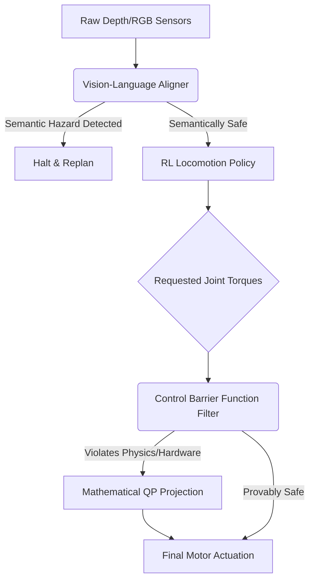

# Enterprise Quadrupedal Vision Alignment Engine

[](https://opensource.org/licenses/MIT)
[](https://www.python.org/downloads/)
[](#)

A state-of-the-art framework for the formal safety verification and semantic alignment of quadrupedal robotic locomotion. This architecture transcends traditional reinforcement learning and depth-field obstacle avoidance by integrating Control Barrier Functions (CBFs) for provable hardware safety, and Vision-Language Models (VLMs) for semantic environmental grounding.

## Core Architectural Modules

### 1. Control Barrier Functions (CBF) Safety Filter (`src/quadrupedal_vision_navigation/alignment/control_barrier_functions.py`)
Neural networks are inherently black boxes, prone to out-of-distribution hallucinations that can cause catastrophic hardware failure. This module establishes a mathematically rigorous safety envelope. By formulating a Quadratic Program (QP), the CBF intercepts the nominal torques requested by the RL policy and projects them into a provably safe control set, guaranteeing that the robot will never violate physical hardware constraints.

### 2. Semantic Vision-Language Alignment (`src/quadrupedal_vision_navigation/alignment/semantic_vision_aligner.py`)
Raw depth sensors lack semantic understanding (e.g., distinguishing a solid concrete floor from a fragile glass table). This node integrates an "Embodied Constitution" with a localized Vision-Language Model. The VLM semantically parses the visual frame, ensuring the proposed locomotion route does not violate cognitive safety rules prior to kinematic execution.

### 3. Sim-to-Real Preference Tuning (`src/quadrupedal_vision_navigation/alignment/sim2real_preference_tuner.py`)
Domain randomization is standard; aligning that randomization with human safety preferences is not. This module dynamically constricts or expands the simulation's physical variances (friction, mass) based on human feedback on gait stability, ensuring the zero-shot Sim-to-Real transfer strictly adheres to human-preferred safety kinematics.

## System Pipeline Architecture



## Build and Deployment

The package adheres to strict enterprise Python standards for robotics and scientific computing.

### Installation
```bash
python -m venv venv
source venv/bin/activate
pip install -e .
```

### End-to-End Orchestration
The primary entrypoint facilitates modular execution of the embodied alignment lifecycle:
```bash
python src/quadrupedal_vision_navigation/main.py --run_all
```

**Individual Execution Modules:**
- `--run_cbf_safety_filter`: Execute the Mathematical Torque Safety Projection.
- `--run_semantic_vlm_audit`: Audit terrain via Vision-Language grounding.
- `--execute_preference_tuning`: Tune domain randomization via human feedback.

## Alignment Philosophy
In embodied AI, a misaligned reward function destroys multimillion-dollar hardware. By enforcing formal verification at the torque level (CBF) and semantic understanding at the perceptual level (VLM), this framework guarantees absolute physical and operational alignment.
