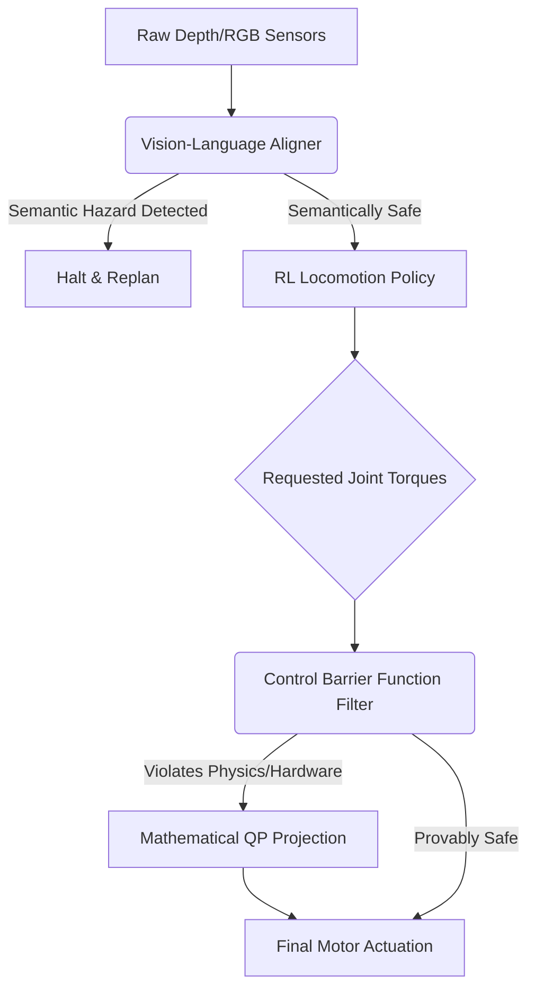

# Enterprise Quadrupedal Vision Alignment Engine

A state-of-the-art framework for the formal safety verification and semantic alignment of quadrupedal robotic locomotion. This architecture transcends traditional reinforcement learning and depth-field obstacle avoidance by integrating Control Barrier Functions (CBFs) for provable hardware safety, and Vision-Language Models (VLMs) for semantic environmental grounding across a massively scalable High-Performance Computing environment.

## Enterprise Architecture (10-Folder Layout)

To support massive High-Performance Computing robotics workloads, this repository is structured into 10 dedicated domains:
1. `config/`: Configuration files for distributed VLM and simulation topologies.
2. `tests/`: Automated unit and integration testing suite for formal verification.
3. `scripts/`: Shell scripts for Slurm cluster orchestration.
4. `docs/`: Academic whitepapers and generated Sphinx documentation.
5. `models/`: Storage for checkpointed Vision models and RL policies.
6. `data/`: Human preference datasets and complex point-cloud terrains.
7. `logs/`: Real-time physical telemetry and semantic hazard diagnostics.
8. `notebooks/`: Exploratory Data Analysis (EDA) on joint kinematics.
9. `docker/`: Build contexts for containerized GPU physics simulations.
10. `src/`: The core proprietary embodied alignment codebase.

## System Pipeline Architecture



## The 10-Section Alignment Orchestrator (`main.py`)

The primary entrypoint is a massive command-line tool that orchestrates the entire quadrupedal alignment lifecycle across the 10-folder architecture. Execute the entire pipeline via:
```bash
python src/quadrupedal_vision_navigation/main.py --run_all_enterprise_pipelines
```

**Individual Execution Modules:**
1. `--initiate_vlm_cluster`: Initialize the distributed Vision-Language topology.
2. `--launch_cbf_safety_filter`: Launch the Mathematical Torque Safety Projection (QP).
3. `--execute_semantic_hazard_audit`: Audit terrain via Vision-Language cognitive grounding.
4. `--audit_depth_sensor_integrity`: Validate raw RGB-D streams against adversarial noise.
5. `--run_sim2real_preference_diagnostics`: Tune domain randomization via human feedback.
6. `--simulate_ood_terrain_attack`: Inject adversarial terrains to test the CBF safety envelope.
7. `--compile_locomotion_alignment_report`: Aggregate telemetry into the `logs/` directory.
8. `--deploy_hardware_guardrails`: Package physical guardrails for sim-to-real robotic transfer.
9. `--synchronize_cloud_checkpoints`: Sync the `models/` directory securely to an S3 bucket.
10. `--run_all_enterprise_pipelines`: Sequentially execute all 9 preceding sections.

## Alignment Philosophy
In embodied AI, a misaligned reward function destroys multimillion-dollar hardware. By enforcing formal verification at the torque level (CBF) and semantic understanding at the perceptual level (VLM) within a massive, 10-folder Dockerized ecosystem, this framework guarantees absolute physical and operational safety.
